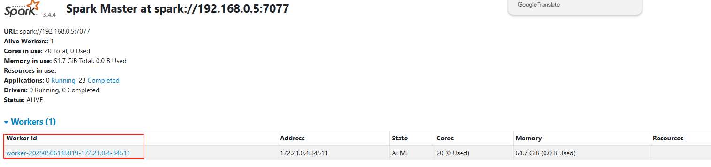

# 🚀 系统运行指南
## 🛠️ 一、准备工作
### 系统要求

| 组件 | 版本要求          |
|------|---------------|
| JDK | 1.8           |
| Node.js | 18+           |
| yarn | v1.22.22+     |
| DM8 | 大小写不敏感、GB18030编码 |
| Redis | 5.0+          |
| RabbitMQ | 无版本要求         |
| Maven | 3.6+          |
| Docker | 1.13.1+       |
| Docker Compose | 1.28.0+       |

## 📁 二、目录结构
### 2.1 项目结构&#xA;
```
├─DATAMASTER-framework           # 公共配置模块
├─DATAMASTER-server              # 启动项目
├─DATAMASTER-module-system       # 系统管理模块
├─DATAMASTER-module-att          # 基础管理模块
├─DATAMASTER-module-dp           # 数据标准管理模块
├─DATAMASTER-module-da           # 数据资产模块
├─DATAMASTER-module-dpp          # 数据汇聚模块
├─DATAMASTER-module-ds           # 数据服务模块
├─DATAMASTER-api-ds              # ds调度器接口模块
├─DATAMASTER-etl                 # spark-etl程序模块
├─DATAMASTER-ui                  # 前端模块
├─sql                       # sql脚本
├─README.md                 # 相关介绍
├─DEPLOY.md                 # 快速启动
```
### 2.2 后端结构&#xA;
```
├─DATAMASTER-framework           # 公共配置模块
├─   ├─DATAMASTER-websocket      # websocket模块
├─   ├─DATAMASTER-security       # security模块
├─   ├─DATAMASTER-redis          # redis模块
├─   ├─DATAMASTER-quartz         # 定时任务模块
├─   ├─DATAMASTER-mybatis        # mybatis配置
├─   ├─DATAMASTER-generator      # 代码生成器
├─   ├─DATAMASTER-file           # 文件管理模块
├─   ├─DATAMASTER-es             # es模块
├─   ├─DATAMASTER-config         # 配置模块
├─   ├─DATAMASTER-common         # 共通模块
├─   ├─DATAMASTER-auth           # oauth2模块
├─DATAMASTER-server              # 启动项目
├─DATAMASTER-module-system       # 系统管理模块
├─DATAMASTER-module-att          # 基础管理模块
├─DATAMASTER-module-dp           # 数据标准管理模块
├─DATAMASTER-module-da           # 数据资产模块
├─DATAMASTER-module-dpp          # 数据汇聚模块
├─DATAMASTER-module-ds           # 数据服务模块
├─DATAMASTER-api-ds              # ds调度器接口模块
├─DATAMASTER-etl                 # spark-etl程序模块
```

### 2.3 前端结构&#xA;

```
├─DATAMASTER-ui                  # 前端模块
├─   ├─public                   # 静态资源目录
├─   ├─vite.config.js           # Vite配置文件
├─   ├─src
├─   |  ├─views                     # 页面视图
├─   |  |   ├─system                # 系统管理模块
├─   |  |   ├─att                   # 基础管理模块
├─   |  |   ├─dp                    # 数据标准管理模块
├─   |  |   ├─da                    # 数据资产模块
├─   |  |   ├─dpp                   # 数据汇聚模块
├─   |  |   ├─ds                    # 数据服务模块
├─   |  ├─utils                 # 工具类
├─   |  ├─store                 # 状态管理
├─   |  ├─router                # 路由
├─   |  ├─plugins               # 插件
├─   |  ├─layout                # 布局
├─   |  ├─components            # 通用组件
├─   |  ├─assets                # 图片、样式等资源
├─   |  ├─api                   # 接口
├─   ├─.env.development         # 开发环境配置
├─   ├─.env.production          # 生产环境配置
```

## 🚀 三、快速启动

### 3.1 Spark 部署（Linux 环境） 

#### 1. 下载 Spark
🔗 [Spark 3.5.5下载](https://downloads.apache.org/spark/spark-3.5.5/spark-3.5.5-bin-hadoop3.tgz)

#### 2. 验证 Java 环境
```
java -version

#  预期输出

java version "1.8.0\_441"
Java(TM) SE Runtime Environment (build 1.8.0\_441-b07)
Java HotSpot(TM) 64-Bit Server VM (build 25.441-b07, mixed mode)
```

#### 3. 解压文件
```
tar -xzf spark-3.5.5-bin-hadoop3.tgz
```

#### 4. 启动 Master 节点
```
cd spark/sbin

./start-master.sh
```

✅ 验证：访问 `http://<服务器IP>:8080` ，若显示 Spark 管理页面则启动成功。📋 记录 Master URL（如：`spark://127.0.0.1:7077`），用于启动 Worker 节点。


#### 5. 启动 Worker 节点
```
cd spark/sbin

./start-slave.sh <Master URL>  # 替换为上一步记录的URL
```

✅ 验证：刷新 Spark 管理页面，检查 "Workers" 列表是否新增节点（如图示）。



### 3.2 DS 调度器启动 

**1. 获取代码**  
- 🔗 [百度网盘](https://pan.baidu.com/s/5A7-TUZ_EujpsWO93RektIg)
  
**2. 启动指南**  
🔗 [DolphinScheduler 开发环境搭建](https://dolphinscheduler.apache.org/zh-cn/docs/3.2.2/contribute/development-environment-setup)

### 3.3 后端配置文件修改 ⚙️&#xA;

##### 1. 切换开发环境

```
#  application.properties
spring:
 profiles:
   active: dev  # 设置为开发环境
```

##### 2. 配置关键参数（application-dev.yml）
```
# 主数据源选择
datasource:
  type: mysql #目前已支持mysql、dm8
  
# MySQL配置文件
mysql:
  driver-class-name: com.mysql.cj.jdbc.Driver
  url: jdbc:mysql://127.0.0.1:3306/DATAMASTER?characterEncoding=UTF-8&useUnicode=true&useSSL=false&tinyInt1isBit=false&allowPublicKeyRetrieval=true&rewriteBatchedStatements=true&serverTimezone=Asia/Shanghai
  username: <数据库账号>  # 替换为实际账号
  password: <数据库密码>  # 替换为实际密码

#  达梦数据库配置
dm8:
 driver-class-name: dm.jdbc.driver.DmDriver
 url: jdbc:dm://127.0.0.1:5236/DATAMASTER?STU\&zeroDateTimeBehavior=convertToNull\&useUnicode=true\&characterEncoding=utf-8\&schema=DATAMASTER\&serverTimezone=Asia/Shanghai
 username: <数据库账号>  # 替换为实际账号
 password: <数据库密码>  # 替换为实际密码

#  RabbitMQ配置
rabbitmq:
 host: 127.0.0.1
 port: 40003
 username: <账号>  # 替换为实际账号
 password: <密码>  # 替换为实际密码

#  DS调度器配置
ds:
 base_url: http://127.0.0.1:12345/dolphinscheduler
 token: <调度器令牌>  # 在调度器-安全中心-令牌管理中创建
 spark:
   master_url: spark://127.0.0.1:7077  # 与Spark Master地址一致
   main_jar: file:/dolphinscheduler/default/resources/spark-jar/DATAMASTER-etl-3.8.8.jar  # 上传etl包后路径
   main_class: tech.qiantong.DATAMASTER.spark.etl.EtlApplication
```

### 3.4. 初始化数据库
1. **创建数据库模式**
    - 默认模式名称：`DATAMASTER` (mysql默认模式为`DATAMASTER`)
    - 如需修改：编辑 `sql/dm/dm.sql`或`sql/mysql/mysql.sql` 文件中的模式名称

2. **执行初始化脚本**
   ```bash
   # 使用达梦命令行工具执行
   disql SYSDBA/SYSDBA@127.0.0.1:5236 -f sql/dm/dm.sql
   
   # 使用Navicat工具执行
   sql/mysql/mysql.sql
   ```

### 3.5. 启动后端服务
```
#  执行主类DataMasterApplication的main方法
#  成功提示
(♥◠‿◠)ﾉﾞ  dataMaster 千数平台启动成功！  ლ(´ڡ\`ლ)ﾞ
```

### 3.6 前端配置与启动 

#### 1. 配置代理（vite.config.js）
```
// 代理配置
server: {
 port: 81,
 host: true,
 open: true,
 proxy: {
   "/dev-api": {
     target: "http://<后端IP>:<端口号>",  // 替换为实际后端地址，例如http://localhost:8080
     changeOrigin: true,
     rewrite: (p) => p.replace(/^\\/dev-api/, ""),
   }
 }
}
```

#### 2. 安装依赖
```
cd DATAMASTER-ui

yarn install  # 或 npm install
```

#### 3. 启动前端服务

```
yarn run dev  # 或 npm run dev
```

#### 4. 浏览器访问 🚀 打开 `http://localhost:81` 进入系统
