# DataMaster 项目说明

DataMaster 是一个面向银行金融数据治理场景的数据中台系统，采用 Java 8 多模块 Maven 后端和 Vue 3 + Vite 前端。系统覆盖空间管理、数据源管理、数据资产、元数据目录、数据标准、数据采集、ETL、质量探查、数据服务、数据建模和数据智能体等能力。

本文档记录项目整体架构、模块职责、核心流程、启动依赖和排查入口。重构目标、字段规范化、已改模块清单等改造过程记录单独维护在：

```text
docs/整体规范化改造目标与方案.md
```

## 1. 项目定位与架构原则

DataMaster 是一个企业级数据中台和数据治理平台，不是单纯的 CRUD 后台。平台将外部数据源、元数据目录、数据资产、本体语义和数据应用分层管理；空间权限贯穿各层。

需要先区分四类数据：

| 层次 | 主要来源 | 作用 |
| --- | --- | --- |
| 真实数据源 | 用户注册的数据库、Doris、文件等 | 实际查询、写入和 ETL 执行 |
| 元数据目录 | `CAT_TABLE`、`CAT_COLUMN` | 探查得到的库、表、字段结构 |
| 数据资产 | `AST_ASSET`、`AST_ASSET_COLUMN` | 业务登记、空间权限、字段治理和脱敏 |
| 业务配置 | 数据服务参数、本体绑定、任务配置等 | 各应用保存的业务定义 |

“资产优先、元数据回退”是部分治理和语义流程的规则，不是所有模块的字段读取规则。各模块的真实来源以第 6 节矩阵为准。

核心能力包括：

- 空间管理和空间权限隔离
- 数据源注册、测试、同步和复用
- 数据资产登记、分类、字段管理和权限控制
- 元数据采集、目录维护和版本同步
- 数据标准、数据元和标准文档管理
- 数据集成、ETL 编排和调度执行
- 质量探查规则、质量任务和结果管理
- 数据服务 API 发布、SQL 执行和外部调用
- 数据建模
- 数据智能体查询、SQL 生成、图表分析、报告和决策建议

整体业务路径可以理解为：

```text
空间和用户权限
  -> 数据源注册
  -> 元数据采集 / 资产登记
  -> 标准、分类、权限治理
  -> ETL / 质量 / 数据服务 / 数据智能体应用
```

## 2. 技术栈

### 后端

- Java 8
- Spring Boot 2.5.x
- Spring Security
- MyBatis-Plus
- Dynamic Datasource
- Druid
- Redis
- RabbitMQ
- PageHelper
- Knife4j / Swagger
- DolphinScheduler API 适配
- Flink / ChunJun

### 前端

- Vue 3
- Vite 5
- Element Plus
- Pinia
- Vue Router
- ECharts
- CodeMirror / Monaco
- AntV X6

## 3. 项目结构

根目录是一个多模块 Maven 工程，整体采用“启动入口 + 业务模块 + 公共基础能力 + 前端工程”的结构。

```text
datamaster-server        后端启动入口，聚合全部业务模块
datamaster-system-api    系统公共 API、DTO 和跨模块接口模型
datamaster-system        用户、角色、菜单、部门、字典和系统权限
datamaster-common        数据源、DbQuery、动态数据源、MyBatis、缓存、安全和 WebSocket
datamaster-governance    数据标准、数据元、码表、敏感等级、脱敏规则、逻辑模型和空间治理
datamaster-metadata      元数据探查、目录版本和质量探查
datamaster-assets        数据源、数据资产、资产字段、权限、申请审批、表治理和脱敏
datamaster-ontology      本体概念、属性、关系、动作、函数和对象实例
datamaster-service       数据服务 API、SQL 执行、参数映射、限流、缓存和日志
datamaster-collector     ETL、数据开发、任务编排、调度发布和实例日志
datamaster-ai            数据智能体、决策智能体、Skill、SQL 生成和模型适配
datamaster-ingestion     Kafka/Doris 数据接入和本体决策触发
datamaster-api-ds        DolphinScheduler HTTP 适配层
datamaster-ui            Vue 3 + Vite 前端
sql                      数据库脚本
docs                     项目文档
docker                   容器和部署相关资源
deploy                   部署资源
```

根 `pom.xml` 聚合后端模块，后端主启动类为：

```text
datamaster-server/src/main/java/com/datamaster/server/DataMasterApplication.java
```

前端入口位于：

```text
datamaster-ui/
```

整体调用关系：

```text
datamaster-ui
      -> datamaster-server（Spring Boot 聚合启动）
      -> system / governance / metadata / assets
      -> ontology / service / collector / ai / ingestion
      -> common（DbQuery、数据源、缓存、安全、MyBatis）
      -> 平台主库、Redis、RabbitMQ、DolphinScheduler、外部数据源
```

主要数据流：

```text
外部数据源 --探查--> CAT_TABLE / CAT_COLUMN
CAT_TABLE / CAT_COLUMN --同步/登记--> AST_ASSET / AST_ASSET_COLUMN
AST_ASSET --绑定--> 本体概念 / 属性 / 关系 / 动作
本体、资产、元数据 --提供上下文--> AI / 数据服务 / ETL / 数据查询
Kafka --接入--> Doris --可选触发--> 本体动作/决策
```

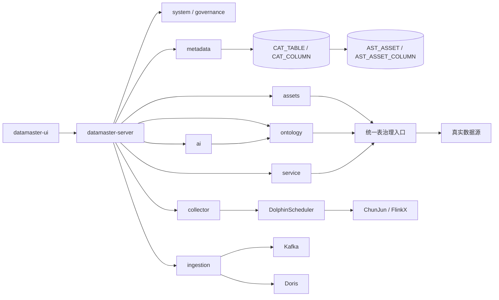

## 4. 模块职责

### 4.1 datamaster-common

公共基础框架，提供跨模块复用能力。

主要子模块：

| 子模块 | 职责 |
| --- | --- |
| `datamaster-common-common` | 公共注解、枚举、工具类、统一返回、异常处理；**数据库 SQL 执行能力**（`DbQuery` 接口、`DataSourceFactory`、`DbQueryProperty`、数据库方言、查询工厂） |
| `datamaster-common-datasource` | 动态数据源、连接管理、安全认证、Redis 封装 |
| `datamaster-common-datasource-mgmt` | 公共数据源管理（`IDatasourceApiService`、`IDatasourceMgmtService`、`DatasourceRespDTO`、`DatasourceSpaceRelMgmtMapper`） |
| `datamaster-common-config` | 公共配置、拦截器、轻量定时能力 |
| `datamaster-common-mybatis` | MyBatis-Plus 配置、分页、数据权限相关扩展 |
| `datamaster-common-websocket` | WebSocket 消息推送 |

### 4.2 datamaster-system

系统管理模块，负责用户、角色、菜单、部门、字典、权限、操作日志等基础后台能力。

空间改造后，系统角色和菜单权限会结合空间上下文进行权限隔离。

### 4.3 datamaster-governance

治理模块集中负责数据标准、数据元、码表、敏感等级、脱敏规则、逻辑模型和空间相关治理配置。它不负责探查外部数据库的库表字段；外部结构由 `datamaster-metadata` 采集。

资产字段、模型字段、质量规则和数据服务脱敏配置可以引用治理模块中的标准定义。

### 4.4 datamaster-assets

数据资产核心模块，负责数据源、资产、资产字段、资产申请、资产权限、表治理权限校验、脱敏和数据智能体资产侧能力。

**依赖关系**：资产依赖 `datamaster-metadata`（元数据）获取库表字段结构，是元数据的主要业务消费方。

主要职责：

- 数据源注册、测试连接、配置保存、同步调度平台
- 资产登记、资产目录、字段管理
- 数据源级、表级、字段级访问控制（`AssetsTableGovernanceApiServiceImpl`，统一权限校验入口）
- 资产申请和审批
- 数据预览、字段脱敏、用户数据权限等级控制
- 为本体、数据服务、采集、质量和数据智能体提供数据源与资产能力
- 未命中资产时通过 `CatalogTableApiService` 回退到元数据目录，作为表级治理解析依据

### 4.5 datamaster-collector

采集和 ETL 任务模块，负责任务配置、节点编排、发布、执行、实例日志和状态回写。

主要职责：

- 数据集成任务管理
- 数据开发任务管理
- 任务节点、关系、位置、实例日志管理
- 调用 `datamaster-api-ds` 发布和执行 DolphinScheduler 工作流
- 生成 ChunJun / FlinkX 任务 JSON
- 处理增量任务边界、回调和状态同步

### 4.6 datamaster-service

数据服务模块，负责把 SQL、参数映射、权限控制和数据源执行封装成可发布 API。

主要职责：

- API 定义和发布
- 请求参数映射
- SQL 测试执行
- API 调用日志
- 限流、缓存、白名单
- API 配置时选择数据源、表、请求参数和返回字段
- 执行前调用统一表治理入口，按“数据资产优先、元数据回退”解析表
- 命中数据资产时执行字段权限、隐藏字段和数据脱敏
- 未命中数据资产时仍按已保存的 API SQL/字段配置执行，不自动替换为元数据字段

### 4.7 datamaster-metadata

元数据探查与质量探查模块，负责采集外部数据源的库、表、字段、索引、分区、存储等结构信息，维护目录和版本，并对库表执行质量规则探查、产出质量报告。

作为数据底层，为 `datamaster-assets`（资产）、`datamaster-ai`（数据智能体）、`datamaster-service`（数据服务）等模块提供表结构元数据。

### 4.8 datamaster-api-ds

DolphinScheduler HTTP API 适配层，封装项目、任务、调度、执行、上下线、数据源同步等接口。

业务模块通过该层调用 DolphinScheduler，避免在各模块里散落 HTTP 调用细节。

### 4.9 datamaster-ai

数据智能体能力层，包含决策智能体对话、Skill、SQL 生成和模型适配。平台对外只暴露数据智能体/决策智能体；具体模型或数据问答引擎（包括 DB-GPT）只是可替换的内部适配器，不参与平台产品命名，也不把其原生提示语直接返回给用户。决策智能体依赖本体作为语义入口；单表、多表 Skill 根据资产和元数据可用性分别处理回退。

### 4.10 datamaster-ingestion

独立的数据接入模块。消费 Kafka 消息，写入 Doris，记录接入日志，并按配置调用本体决策/动作触发接口。

### 4.11 datamaster-ontology

本体模块负责概念、属性、关系、动作、函数和对象实例。概念绑定物理表，属性绑定物理字段，关系描述对象关联，动作负责语义化读写。

### 4.12 datamaster-ui

前端工程，提供空间、数据源、资产、目录、标准、采集、ETL、质量、服务、本体、数据智能体和决策智能体等页面。

## 5. 核心业务流程

### 5.1 空间管理

空间是平台内的数据治理、权限隔离和任务上下文维度。

```text
创建空间
  -> 分配空间成员
  -> 配置空间角色和菜单权限
  -> 绑定数据源、资产和任务上下文
  -> 用户在当前空间内操作数据资产和任务
```

### 5.2 数据源管理

数据源管理用于登记外部数据库、中间件、文件系统等连接信息。

```text
新增数据源
  -> 测试连接
  -> 保存连接配置
  -> 绑定空间
  -> 刷新 Redis datasource 缓存
  -> 同步 DolphinScheduler 源中心
  -> 被资产、目录、质量、ETL、数据服务复用
```

核心表：

```text
AST_DATASOURCE
AST_DATASOURCE_SPACE_REL
```

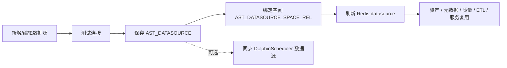

### 5.3 数据资产

数据资产模块负责资产登记、资产分类、字段维护、资产申请和访问控制。

```text
注册数据源
  -> 元数据采集或人工登记资产
  -> 维护资产字段
  -> 绑定分类、标准、敏感等级
  -> 分配空间权限或走资产申请审批
  -> 被数据服务、数据智能体、质量、ETL 使用
```

资产与元数据的同步关系如下：

```text
元数据采集：读取外部数据源 -> CAT_TABLE / CAT_COLUMN
资产同步：按 tableId 优先匹配资产，匹配不到再按数据源 + 表名匹配
          -> 更新或新建 AST_ASSET
          -> 从 CAT_COLUMN 同步 AST_ASSET_COLUMN
```

资产同步是“元数据目录写入数据资产”，不是运行时查询回退。运行时是否使用资产或元数据，由各业务入口自己的解析流程决定，详见“数据来源解析矩阵”。

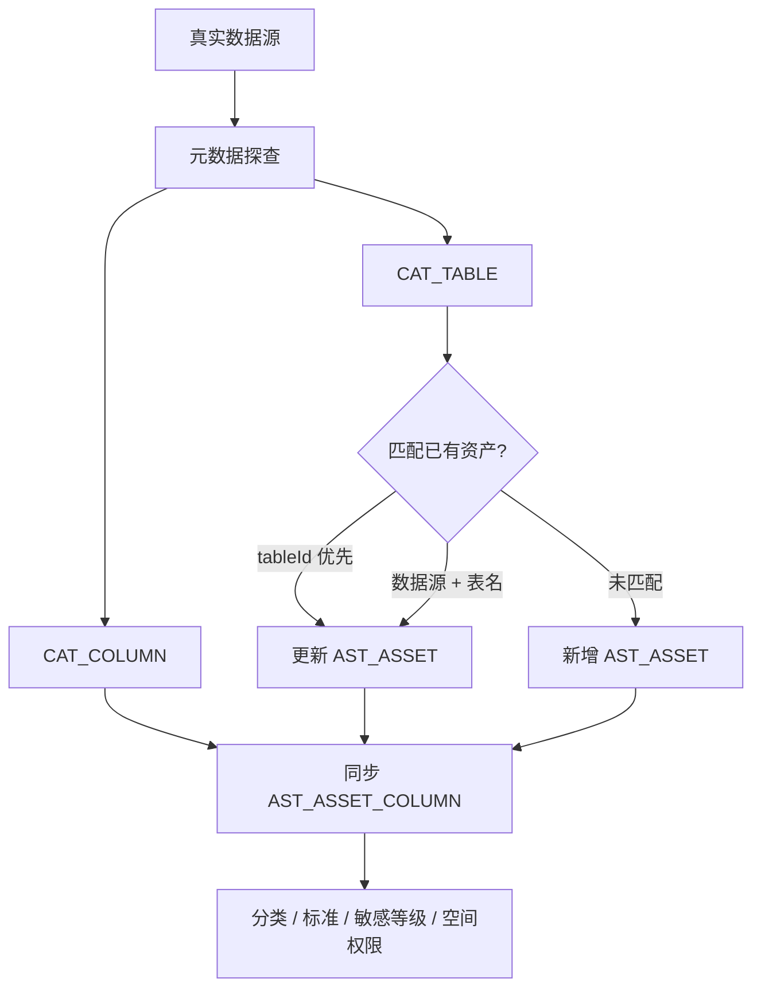

### 5.4 元数据目录与质量探查

`datamaster-metadata` 同时承载元数据目录和质量探查能力，负责扫描外部数据源结构，并沉淀库、表、字段、索引、分区等元数据。

```text
创建采集任务
  -> metadata/collector 创建并发布 DolphinScheduler 工作流
  -> 调度平台回调系统采集接口
  -> 读取数据源结构
  -> 比对元数据变化
  -> 写入目录和版本记录
  -> 按质量任务配置执行规则探查
  -> 写入质量结果和报告
```

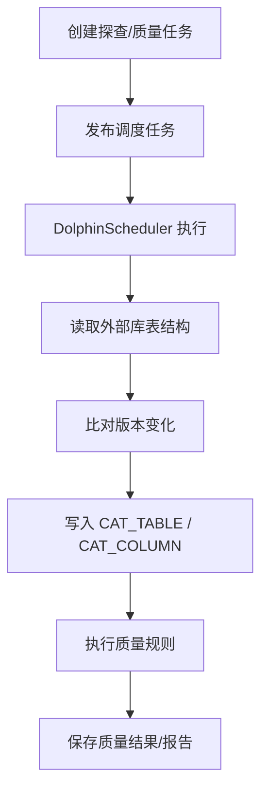

#### 5.4.1 统一表治理回退

元数据探查完成后，数据查询、数据服务、AI 和本体等入口可通过资产治理服务判断使用资产还是元数据表：

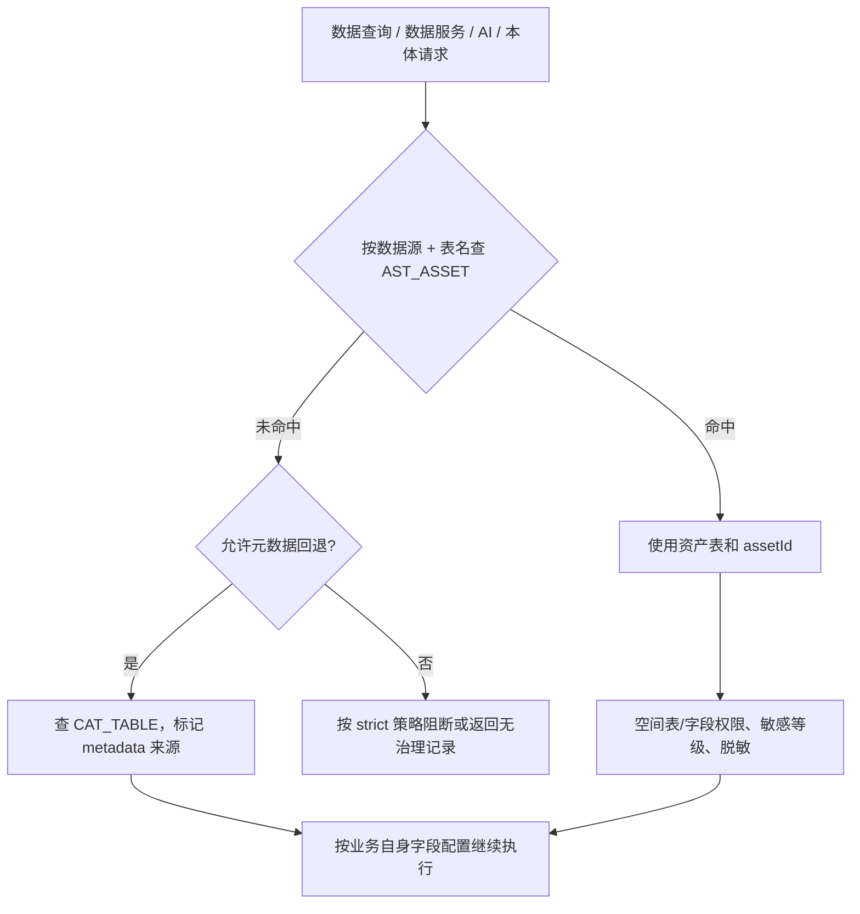

### 5.5 数据标准

数据标准用于统一数据元、标准文档、码表、敏感等级和脱敏规则。

```text
维护标准目录
  -> 维护标准文档 / 数据元 / 码表
  -> 资产字段挂载标准
  -> 在治理、质量、建模、服务中复用
```

### 5.6 本体与对象执行

本体把物理表和字段抽象为概念、属性、关系、动作和函数，供对象查询、动作执行和 AI 使用。

```text
绑定概念和物理表
  -> 绑定属性和物理字段
  -> 配置关系和主客体字段
  -> 配置动作/函数
  -> 对象查询或提交动作
  -> 权限校验、审批（需要时）
  -> 生成 SELECT / INSERT / UPDATE / DELETE
  -> 执行事务并记录前后值
```

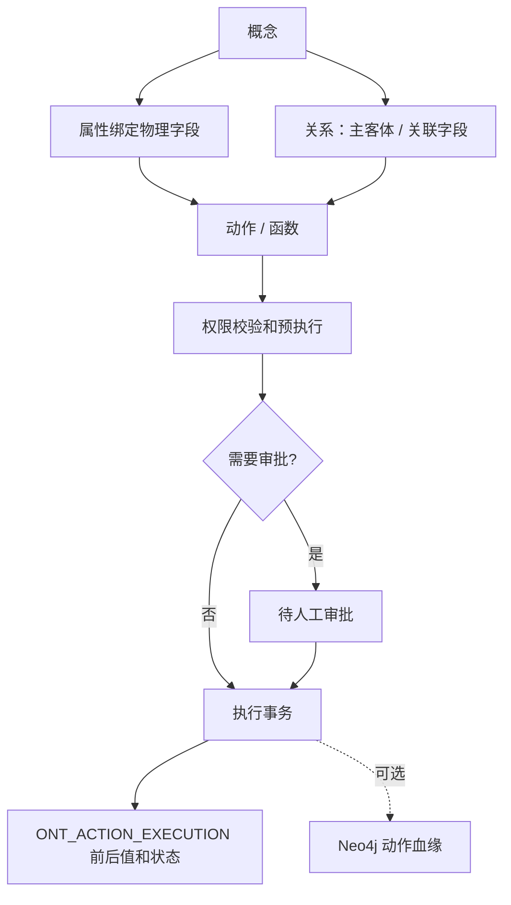

本体生成当前直接使用 `CAT_TABLE` / `CAT_COLUMN`；对象查询和动作权限复用资产表治理入口。关系更新必须使用实际主键和关系条件字段，不能用显示名称代替主键值。

### 5.7 数据集成和 ETL

数据集成由 `datamaster-collector` 管理任务配置，通过 DolphinScheduler 调度，由 ChunJun / FlinkX 执行数据同步和转换。

```text
配置输入、转换、输出
  -> 构建平台任务节点和关系
  -> 转换为 ChunJun / FlinkX Job JSON
  -> 发布 DolphinScheduler 工作流
  -> 调度执行
  -> 回写任务实例和状态
```

支持：

- ChunJun / FlinkX 全量任务
- ChunJun / FlinkX 增量任务
- HTTP 回调辅助增量边界计算
- 任务实例日志和状态同步

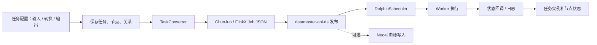

### 5.8 数据开发

数据开发复用 collector ETL 任务体系，通过 `type = 3` 区分。

当前定位：

- SQL 执行
- 存储过程执行
- Shell 执行
- Python 执行

数据开发不单独维护一套后台，发布、执行、调度、实例日志复用 `/col/etlTask` 主链路。

### 5.9 质量探查

质量探查负责质量规则配置、质量任务调度和检测结果管理。

```text
配置质量规则
  -> 创建质量任务
  -> 调度执行
  -> 记录检测结果
  -> 查看问题数据和质量报告
```

### 5.10 数据服务

数据服务将 SQL、参数、权限和数据源执行封装成可调用 API。

```text
创建 API
  -> 选择数据源和配置方式
  -> 配置 SQL、请求参数和返回字段
  -> 测试执行
  -> 发布服务
  -> 外部系统调用
  -> 记录调用日志
```

#### 5.10.1 配置阶段的表和字段来源

当前数据服务配置存在以下取数路径：

| 配置场景 | 当前来源 | 说明 |
| --- | --- | --- |
| 编辑已有 API 时加载表下拉 | `AST_ASSET`（`/ast/asset/getTablesByDataSourceId`） | 读取已登记的数据资产表 |
| 新增 API 或切换数据源后加载表下拉 | 真实数据源表结构（`/ast/dataSource/tableList/{id}`） | 直接读取外部数据源 |
| 选择表后加载请求/返回字段 | 真实数据源字段（`/ast/dataSource/columnsList`） | 当前不是 `AST_ASSET_COLUMN`，也不是 `CAT_COLUMN` |
| SQL 配置方式 | SQL 解析结果 | 返回字段由 SQL 解析得到 |

选中的请求参数和返回字段会保存到数据服务自己的 `reqParams`、`resParams` 配置 JSON 中，不会在运行时自动从资产字段重新生成。

#### 5.10.2 执行阶段的资产优先和元数据回退

数据服务测试执行和发布后的 API 调用都会调用
`AssetsTableGovernanceApiServiceImpl.resolveTable()`：

```text
按数据源 + 表名查 AST_ASSET
  ├── 命中数据资产
  │     -> 返回 assetId
  │     -> 严格模式下校验空间表权限和字段权限
  │     -> 按资产授权字段过滤已配置的返回字段
  │     -> 按 scene=3 执行数据服务脱敏
  │
  └── 未命中数据资产
        -> 开启回退时查 CAT_TABLE
        -> 标记为元数据回退并允许继续执行
        -> 不产生 assetId，不执行资产字段级脱敏
        -> 仍按 API 已保存的 SQL/字段配置查询真实数据源
```

因此当前数据服务的“执行治理”已经是资产优先、元数据回退，但“配置字段来源”还没有统一为资产字段优先。

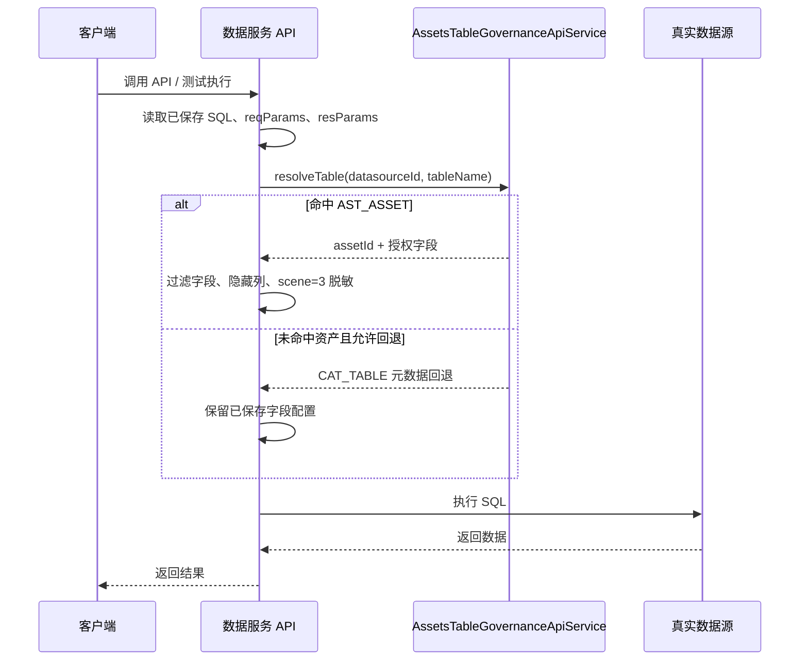

### 5.11 数据智能体与决策智能体

数据智能体基于空间、本体、资产、字段、权限和会话上下文提供自然语言查询、分析与决策建议；其中决策智能体负责理解问题、查询证据和给出建议。

**依赖模型**：决策智能体依赖 `datamaster-ontology`（本体）作为统一语义入口，本体内部再逐级降级到资产与元数据：

```text
决策智能体请求语义数据
  -> 优先走本体（概念/属性/关系/动作，语义层查询）
  -> 无概念映射时，回退资产（表权限 + 表结构）
  -> 资产也无登记时，兜底元数据（裸表结构）
  -> 返回统一语义化结果给 AI
```

```text
选择空间和数据范围
  -> 发起数据智能体对话（按数据成熟度选层：本体 / 资产 / 元数据）
  -> 生成 SQL / 构造 Skill
  -> 权限校验（resolveTable / checkTableAccess）
  -> 执行查询（本体动作 / 决策智能体适配器）
  -> 返回结果 / 图表 / 报告
```

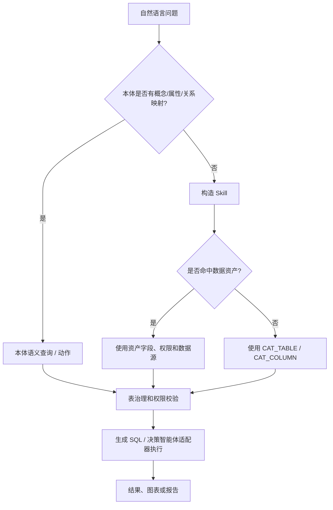

### 5.12 数据接入 ingestion

`datamaster-ingestion` 是独立的数据接入模块，不依赖数据服务 API 配置：

```text
Kafka topic
  -> IngestionKafkaConsumer 消费消息
  -> 解析并写入 Doris
  -> 记录接入日志和结果
  -> 按配置调用本体决策/动作触发接口
```

只有 `datamaster.ingestion.enabled=true` 且配置了 topic 时才启用消费。冲突策略、目标表和触发配置由 `IngestionProperties` 控制。

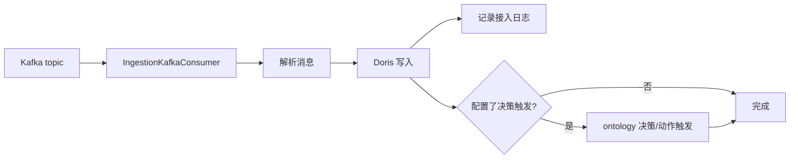

## 5.13 数据脱敏

数据脱敏用于对敏感字段进行区间替换或隐藏，保护用户隐私数据。

### 5.13.1 数据库表

| 表名 | 用途 |
| --- | --- |
| `STD_DATA_CATEGORY` | 数据分类（如：姓名、手机号、身份证） |
| `STD_DATA_LEVEL` | 数据等级 |
| `STD_SENSITIVE_LEVEL` | 敏感等级（数字越小越敏感） |
| `STD_DESENSITIZE_RULE` | 脱敏规则（按 dataCategoryId 关联） |
| `STD_DESENSITIZE_INTERVAL` | 脱敏区间（挂在规则下，定义替换位置） |
| `STD_DESENSITIZE_WHITELIST` | 脱敏白名单（按 dataCategoryId 关联） |
| `STD_DESENSITIZE_USER_REL` | 白名单用户关联 |
| `STD_DESENSITIZE_ASSETCOLUMN` | 字段 → 数据分类绑定关系 |

### 5.13.2 执行流程（公共脱敏方法）

脱敏统一收敛到 `AssetsTableGovernanceApiServiceImpl` 的公共方法，三处场景共用，仅传参 `scene` 不同：

```text
公共方法入口（scene: 1数据资产 / 2数据查询 / 3数据服务）
    ├── desensitizeResultData(assetId, data, userId, userPermissionLevel, scene)
    │    └── 前置隐藏列剔除（flag=3，列敏感等级不足或规则无区间）
    │    └── 区间替换（flag=2，按规则区间替换）
    │    └── 白名单放行（flag=1）
    └── getDesensitizeHideColumns(assetId, userId, userPermissionLevel, scene)
         └── 供 SQL 构建前剔除隐藏列（避免敏感字段进入查询语句）

场景接入点：
    1. 数据资产：AssetsAssetServiceImpl.dataMaskings() 委托 desensitizeResultData
    2. 数据查询：AssetsDatasourceServiceImpl.executeSqlQuery() / exportSqlQueryResult()
       前置 resolveTable 表级权限校验（拒绝访问抛异常阻断，解析失败跳过），
       结果命中资产后调 desensitizeResultData
    3. 数据服务：ApiMappingEngine（发布执行）/ ServiceApiServiceImpl.serviceTesting（测试执行）
       前置 filterDesensitizeHideColumns 剔除隐藏列，结果调 desensitizeResultData
```

字段级脱敏判定（单个列）：

```text
Asset Column
    ├── 1. 敏感等级检查
    │   列敏感等级 < 用户权限等级 → 隐藏列 (flag=3)
    │
    ├── 2. 查绑定关系: std_desensitize_assetcolumn WHERE assetcolumnId = col.id
    │   ├── 无绑定 → 放行 (flag=1)
    │   └── 有绑定 → 拿到 dataCategoryId
    │
    ├── 3. 查脱敏规则: std_desensitize_rule WHERE data_category_id = ?
    │   ├── 规则不存在 → 放行 (flag=1)
    │   ├── validFlag=false 或应用场景不匹配 → 放行 (flag=1)
    │   ├── intervalList 非空 → 区间替换脱敏 (flag=2)
    │   └── intervalList 为空 → 隐藏列 (flag=3)
    │
    └── 4. 查白名单: std_desensitize_whitelist WHERE data_category_id = ?
        ├── validFlag=true + userId匹配 + 时间范围内 → 强制放行 (flag=1)
        └── 否则 → 保持原状态
```

脱敏标记含义：
- `1` = 放行（不脱敏）
- `2` = 区间替换（用 replaceContent 替换指定位置）
- `3` = 隐藏列（整列不返回）

### 5.13.3 区间替换算法

```text
输入: 原始字符串 + 替换内容 + 区间列表(intervalNo, startNum, endNum)
按 intervalNo 排序 → 逐个区间替换 → 替换后偏移量修正
```

示例：原始 `"1234567890"`，replaceContent=`"*"`，区间 `[(3,5), (7,9)]`
→ 结果 `"12***6*890"`

### 5.13.4 前端配置页面

位于 `数据资产 > 数据安全` 菜单下：

| 页面 | 功能 | 关键字段 |
| --- | --- | --- |
| 脱敏规则 | 管理脱敏规则 | name, dataCategoryId, applicationScene, maskType, replaceContent, intervalList |
| 脱敏白名单 | 管理豁免白名单 | name, dataCategoryId, effectiveCategory, startTime, endTime, userList |
| 字段绑定 | 绑定字段到数据分类 | assetId, assetcolumnId, dataCategoryId |

应用场景 (applicationScene):
- `1` = 数据资产
- `2` = 数据查询
- `3` = 数据服务

脱敏类型 (maskType)：固定为 `2`（展示脱敏，查询层脱敏）。系统不支持底层脱敏（无法修改外部数据源）。

生效范围 (effectiveCategory):
- `1` = 用户
- `2` = 角色
- `3` = 部门

### 5.13.5 API 接口

| 模块 | 接口前缀 | 用途 |
| --- | --- | --- |
| 脱敏规则 | `/cat/desensitizeRules/` | CRUD + 区间子表 |
| 脱敏白名单 | `/cat/desensitizeWhitelist/` | CRUD + 用户子表 |
| 字段绑定 | `/cat/standardsDesensitizeList/` | CRUD |
| 数据分类 | `/cat/dataCategory/listAll` | 下拉数据源 |
| 资产列表 | `/ast/asset/list` | 下拉数据源 |
| 资产字段 | `/ast/assetColumn/list?assetId=xxx` | 联动下拉 |
| 用户列表 | `/system/user/list` | 白名单用户选择器 |

### 5.13.6 菜单权限

菜单 ID 2930-2947，按钮权限标识：
- `dg:desensitizerules:*`
- `dg:desensitizewhitelist:*`
- `dg:Standardsdesensitizelist:*`

## 5.14 数据血缘

数据血缘基于 Neo4j 图数据库（可选能力，`datamaster-common/datamaster-common-base` 模块），以 `LineageDataService` 为统一入口，通过开关 `datamaster.lineage.enabled`（默认 false，生产环境可用环境变量 `LINEAGE_ENABLED` 覆盖）控制装配。

### 5.14.1 可插拔机制（关键）

`LineageDataService` 被多处业务以 `@Autowired(required = false) + null 判空` 方式注入：

| 注入方 | 用途 | 开关关闭时的行为 |
| --- | --- | --- |
| `ObjectLineageServiceImpl` | 对象血缘读取（数据/决策维度） | 静默跳过，仅返回 SQL 派生的版本/权限维度 |
| `ActionExecutionServiceImpl` | 动作血缘写入（对象节点 + 决策关系） | 静默跳过，动作执行主流程不受影响 |
| `AssetsAssetServiceImpl` | 资产表级血缘读取 | 返回空血缘，资产详情正常展示 |
| `ObjectInstanceQueryServiceImpl` | 对象实例查询时写数据维度 MATERIALIZES 关系 | 静默跳过 |

即：`LINEAGE_ENABLED=false` 或未安装 Neo4j 时，血缘完全不影响任何业务主流程；只有开启后血缘才真正落库并展示。

### 5.14.2 两条血缘链路

**（1）表级血缘（数据资产侧）**

- 入口：`AssetsAssetServiceImpl.dataLineage(id)` → `LineageDataService.lineage(hostPort, tableName)`
- 展示某张物理表的上/下游血缘：当前表、上游源表、下游目标表，以及连接它们的 ETL Task（`TABLE_TO_TASK` / `TASK_TO_TABLE` 关系），并用 Task 最新执行状态/时间回填节点
- 写入来源：collector ETL 发布时维护表↔任务关系（`LineageDataService.save()/saveTable()`）

**（2）对象血缘（本体语义层，四维度）**

- 入口：`ObjectLineageServiceImpl.objectLineage(conceptId)` → `LineageDataService.objectLineage()`
- 四个维度中仅「数据 + 决策」落 Neo4j，另两个维度实时派生：

| 维度 | 数据来源 |
| --- | --- |
| 数据 | Neo4j：`Object -[MATERIALIZES]-> Table`（对象由物理表支撑）及表级上/下游 |
| 决策 | Neo4j：`ActionExecution -[DECISION_ACTION]-> Object`（动作执行消费/产出该对象） |
| 版本 | SQL：`ONT_ACTION_EXECUTION.beforeData/afterData` 快照派生时间线（不落 Neo4j） |
| 权限 | 资产统一权限入口 `resolveTable`（entrance=`ONTOLOGY_OBJECT_QUERY`）实时计算（不落 Neo4j） |

- 写入来源：`ActionExecutionServiceImpl.writeActionLineageSilently()` 在本体动作（CREATE/UPDATE/DELETE）执行成功/失败后调用 `saveObject()` + `saveActionExecution()`，全部 `try/catch` 静默，绝不影响执行主流程；`ObjectInstanceQueryServiceImpl` 在对象实例查询时维护 `MATERIALIZES` 关系。

### 5.14.3 后端接口

| 接口 | 用途 |
| --- | --- |
| `GET /ast/asset/dataLineage/{id}` | 资产详情的表级血缘图 |
| `GET /ont/object-instance/lineage/{conceptId}` | 本体对象实例的对象血缘（四维度） |

### 5.14.4 前端位置

| 功能 | 前端文件 |
| --- | --- |
| 资产详情「表」Tab 血缘图 | `datamaster-ui/src/views/col/asset/detail/table/lineage.vue` |
| 资产详情页容器（引入血缘 Tab） | `datamaster-ui/src/views/col/asset/detail/index.vue` |
| 对象血缘弹窗（graph/决策/版本/权限 四 Tab） | `datamaster-ui/src/views/ont/object/components/ObjectLineageDialog.vue` |
| 对象血缘图组件 | `datamaster-ui/src/views/ont/object/components/ObjectLineageGraph.vue` |
| 对象血缘图节点组件 | `datamaster-ui/src/views/ont/object/components/ObjectNode.vue` |
| 对象实例列表页（打开血缘弹窗） | `datamaster-ui/src/views/ont/object/index.vue` |
| 资产血缘 API | `datamaster-ui/src/api/ast/asset/asset.js`（`dataLineage`） |

> 补充：`datamaster-ui/src/views/meta/analyses/lineage/index.vue`、`LineageAnalysis.vue`（元数据未发布表详情）等亦含"线分析"类页面，属于元数据血缘分析展示，与上述数据/对象血缘同源或复用图组件。

### 5.14.5 基础设施

Neo4j 为可选中间件（见 7.4）。连接配置使用 Spring Boot 标准前缀 `spring.data.neo4j.uri/username/password`，`Neo4jLineageConfig` 在 `LINEAGE_ENABLED=true` 时装配全部 Repository 与事务管理器。

## 6. 权限控制体系

平台权限分为系统权限、空间权限和数据权限。

### 6.1 系统权限

系统权限由用户、角色、菜单、按钮权限组成，主要由 `datamaster-system` 维护。

```text
用户 -> 角色 -> 菜单 / 按钮权限
```

### 6.2 空间权限

空间是业务隔离维度。用户进入不同空间后，可访问的数据源、资产、任务和菜单能力可能不同。

```text
空间 -> 空间成员 -> 空间角色 -> 空间菜单权限
```

### 6.3 数据权限

数据资产侧采用多级权限控制：

| 控制层级 | 关系表 | 作用 |
| --- | --- | --- |
| 数据源级 | `AST_DATASOURCE_SPACE_REL` | 控制空间可使用哪些数据源 |
| 表级 | `AST_ASSET_SPACE_REL` | 控制空间可访问哪些资产表 |
| 字段级 | `AST_ASSET_COLUMN_SPACE_REL` | 控制空间可查看哪些字段 |
| 用户级 | 用户数据权限等级 + 字段敏感等级 | 控制具体用户能看到哪些敏感列 |

权限判定大致流程：

```text
请求访问资产
  -> 获取当前空间
  -> 判断空间是否具备数据源 / 资产 / 字段权限
  -> 判断用户数据权限等级
  -> 结合敏感等级和脱敏规则返回可见字段与数据
```

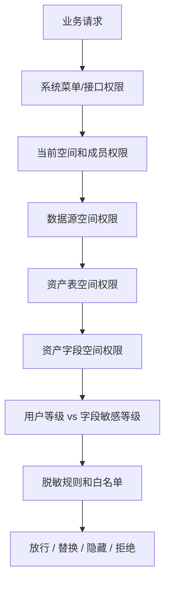

本体动作增删改字段级控制（复用上述字段级授权）：

```text
本体动作提交/执行（Ontology Action CREATE/UPDATE/DELETE）
  -> 提取涉及列（CREATE=插入列，UPDATE=SET列+主键WHERE列，DELETE=WHERE条件列）
  -> 复用 AssetsTableGovernanceApiServiceImpl.checkTableAccess（entrance=ONTOLOGY_CREATE/UPDATE/DELETE）
  -> 写操作严格模式：任一涉及列不在 AST_ASSET_COLUMN_SPACE_REL 授权列内即整体拒绝
  -> SELECT 查询保持表级校验原样，不按字段拦截
  -> 提交（submitExecution）与执行（executeExecution）双重校验，
     执行阶段复用提交快照的 spaceId/spaceCode 防权限被回收后绕过
```

### 6.4 跨模块权限集中架构

平台的表级/字段级权限校验统一收敛在 `datamaster-assets` 的 `AssetsTableGovernanceApiServiceImpl`，各业务模块通过 `datamaster-assets-interface` 依赖资产接口，实现类在 `datamaster-assets-core`（由 `datamaster-server` 聚合注入）。

| 模块 | 依赖的权限接口（assets-interface） | entrance 入口 |
| --- | --- | --- |
| datamaster-ontology（本体） | `IAssetsTableGovernanceApiService.checkTableAccess` | ONTOLOGY_CREATE / UPDATE / DELETE / ACTION |
| datamaster-service（数据服务） | `IAssetsTableGovernanceApiService.resolveTable` | DATA_SERVICE / DATA_SERVICE_TEST |
| datamaster-ai（数据智能体） | `IAssetsTableGovernanceApiService.checkTableAccess/resolveTable` | AI_ASK_DATA / AI_ASK_DATA_PREPARE / AI_ASK_DATA_SKILL |

```text
datamaster-ontology / datamaster-service / datamaster-ai
        │  编译期：只依赖 datamaster-assets-interface
        ▼
datamaster-assets-core  AssetsTableGovernanceApiServiceImpl   ← 唯一权限实现（表级+字段级+脱敏）
        │  未命中资产时回退
        ▼
datamaster-metadata     CatalogTableApiService（元数据目录）
```

降级规则：`resolveTable` 未命中资产时，由 `TableGovernanceProperties` 开关决定——strict 模式按配置拒绝或限制访问，off/warn 模式放行并回退元数据目录进行表级解析。该回退不会自动替换业务模块已经保存的字段配置。

### 6.5 跨模块依赖架构（AI → 本体 → 资产 → 元数据）

参照本体语义层思路，平台运行时优先以本体作为 AI 的语义入口；但代码依赖并不是单向传递。`datamaster-ai` 当前同时依赖本体、资产和元数据接口，`datamaster-ontology` 依赖资产和元数据接口，`datamaster-service` 依赖资产治理接口。SQL 执行能力（`DbQuery`/`DataSourceFactory`）统一来自 `datamaster-common`。

```text
datamaster-ai（数据智能体 / Skill 生成）
   │  运行时优先本体；实现层可直接读取资产/元数据接口
   ▼
datamaster-ontology（本体：概念 / 关系 / 属性 / 动作 / 函数）
   │  依赖资产接口 + 元数据接口
   ▼
datamaster-assets（资产：权限 / 脱敏 / 表结构）
   │  依赖元数据接口（未命中资产回退元数据目录）
   ▼
datamaster-metadata（元数据：目录 / 版本 / 质量探查）
```

三层逐级降级模型（按数据成熟度选层，属于跨模块抽象，不代表每个接口都会自动走完三层）：

| 数据状态 | 上层走哪层 | 语义 |
| --- | --- | --- |
| 已建本体（概念+关系+动作） | 本体接口 | 用业务语义查（概念属性/关系/动作） |
| 有资产但未建本体 | 资产接口 | 表权限 + 表结构 |
| 连资产都未登记 | 元数据目录 | 裸表结构兜底 |

SQL 执行能力归属：

```text
datamaster-common-common           → DbQuery / DataSourceFactory / DbQueryProperty（SQL 能力）
datamaster-common-datasource-mgmt  → IDatasourceApiService / DatasourceRespDTO（数据源元信息）
datamaster-assets-core             → AssetsTableGovernanceApiServiceImpl（权限实现，经 assets-interface 暴露）
datamaster-metadata-core           → CatalogTableApiService 等（元数据实现，经 metadata-interface 暴露）
```

模块间依赖以「接口 jar（`*-interface`）」为边界，实现由 `datamaster-server` 聚合注入，避免上层业务模块直接耦合实现模块。

### 6.6 数据资产与元数据来源解析矩阵

以下是当前代码中“优先查资产、查不到再取元数据”相关流程的实际边界：

| 流程 | 第一来源 | 资产不存在时 | 字段来源/备注 |
| --- | --- | --- | --- |
| 资产同步 | `CAT_TABLE` / `CAT_COLUMN` | 不适用 | 将目录元数据写入 `AST_ASSET` / `AST_ASSET_COLUMN`；匹配已有资产时优先按 `tableId`，再按数据源 + 表名 |
| 手工新增资产 | 表单字段 | 有 `tableId` 且表单无字段时取 `CAT_COLUMN` | 表单有字段时以表单为准 |
| 资产预览 | `AST_ASSET_COLUMN`（按空间权限过滤） | 实时读取真实数据源字段 | 当前不经过 `CAT_COLUMN` |
| 数据查询/数据服务表治理 | `AST_ASSET` | `CAT_TABLE`（由 `resolveTable` 开关控制） | 这是表级治理回退；不会自动替换业务已保存的字段配置 |
| 数据服务表配置（编辑已有 API） | `AST_ASSET` 表 | 无 | 当前字段选择仍调用 `columnsList`，读取真实数据源字段 |
| 数据服务表配置（新增/切换数据源） | 真实数据源表 | 无 | 表下拉调用 `tableList`，字段仍调用 `columnsList` |
| 数据服务 SQL 配置 | SQL 解析结果 | 无 | 返回字段保存到 API 的 `resParams` |
| AI 单表 Skill | 资产及其字段 | 对应 `CAT_TABLE` / `CAT_COLUMN` | 命中已有资产时优先使用资产字段 |
| AI 整库/多表 Skill | 每张表先匹配资产 | 对应元数据表及字段 | 元数据目录为空时才退回资产列表 |
| 本体生成 | `CAT_TABLE` / `CAT_COLUMN` | 不适用 | 当前直接使用元数据目录，未接入资产优先回退 |
| 本体对象查询/动作权限 | 统一 `resolveTable` / `checkTableAccess` | `CAT_TABLE` 表级回退 | 动作写操作还会校验资产字段授权 |

因此，项目当前不是所有模块都使用完全相同的字段链路。统一入口目前主要负责表级治理和权限判断；具体业务是否读取 `AST_ASSET_COLUMN`、`CAT_COLUMN` 或实时数据源字段，仍取决于对应流程的实现。

## 7. 数据源体系

平台数据源分为三层。

### 7.1 平台主库

平台自身业务库通过 `datasource.type` 选择，配置在：

```text
datamaster-server/src/main/resources/application-dev.yml
datamaster-server/src/main/resources/application-prod.yml
```

主库用于存储系统用户、空间、资产、目录、任务、质量、服务等平台业务数据。

### 7.2 用户注册数据源

用户在数据源管理页面注册外部数据源，供资产、目录、质量、ETL、服务和数据智能体使用。

关键机制：

- 连接信息加密存储
- 创建和更新时测试连接
- 启动或变更时刷新 Redis hash `datasource`
- 同步到 DolphinScheduler 源中心
- 通过统一方言能力获取表、字段、预览数据

### 7.3 基础设施中间件

平台运行依赖：

| 组件 | 用途 |
| --- | --- |
| Redis | 缓存、登录态、数据源信息、任务状态 |
| RabbitMQ | 异步消息、任务状态推送 |
| DolphinScheduler | 工作流调度、任务发布和执行 |
| Flink / ChunJun | 数据集成执行引擎 |
| HDFS | 文件和资源存储能力 |
| MongoDB | 部分可选能力 |
| Neo4j | 可选血缘图存储，不是核心业务必需依赖 |

### 7.4 Neo4j 使用说明

Neo4j 只用于血缘增强能力：

- 资产表级血缘：表 → ETL 任务 → 表；
- 本体对象血缘：对象 → 物理表；
- 动作/决策血缘：动作执行 → 对象。

它不负责数据服务查询、资产同步、元数据探查、权限校验、动作事务或动作前后值审计。后者由平台主库、资产治理服务和真实数据源完成。

默认配置为关闭：

```yaml
datamaster:
  lineage:
    enabled: ${LINEAGE_ENABLED:false}
```

启用时还需要配置：

```yaml
spring:
  data:
    neo4j:
      uri: bolt://<host>:7687
      username: <username>
      password: <password>
```

关闭开关或不部署 Neo4j 时，ETL、数据服务、本体动作、资产预览等主流程仍可运行；受影响的只是 Neo4j 提供的图血缘维度，版本和权限等 SQL 派生信息仍可用。

当前 `spring-boot-starter-data-neo4j` 位于 `datamaster-common-base`，因此构建时会被相关模块间接带入；但运行时由 `LINEAGE_ENABLED` 控制是否装配。若后续需要进一步降低基础依赖，应将 Neo4j 代码和依赖拆到独立的 lineage 模块。

## 8. 动态数据源路由

后端启动类排除了 Spring Boot 默认数据源自动配置，平台使用自定义动态数据源体系。

核心链路：

```text
请求进入
  -> AOP / 上下文设置当前数据源 key
  -> DynamicDataSourceContextHolder 保存 ThreadLocal
  -> DynamicDataSource 根据 key 路由
  -> 目标数据源执行
```

主要类：

- `DynamicDataSource`
- `DynamicDataSourceContextHolder`
- `DynamicDataSourceAspect`
- `MasterDataSourceConfig`
- `@DataSource`
- `DataSourceType`

用户注册的数据源不等于平台主库，它们主要用于资产预览、元数据采集、质量检测、ETL 和数据服务执行。

## 9. 调度调用链路

### 9.1 元数据采集任务

元数据采集使用 DolphinScheduler HTTP 节点回调本系统接口。

```text
用户创建探查任务
  -> 元数据探查任务服务创建 DS HTTP 工作流
  -> DolphinScheduler 调度执行
  -> HTTP 节点回调采集接口
  -> 系统读取数据源结构
  -> 写入元数据目录并产出质量报告
```

### 9.2 ChunJun / FlinkX 全量 ETL

```text
用户配置 ETL 任务
  -> Collector 保存任务草稿和节点
  -> TaskConverter 组装 reader / transition / writer
  -> FlinkxEtlTaskConverter 生成 ChunJun Job JSON
  -> TaskConverter 构建 DS CHUNJUN 任务定义
  -> datamaster-api-ds 调用 DolphinScheduler 发布
  -> DolphinScheduler Worker 调用 ChunJun 执行
  -> 回写任务状态和实例日志
```

### 9.3 ChunJun / FlinkX 增量 ETL

增量任务在 CHUNJUN 节点前后增加 HTTP 辅助节点。

```text
HTTP 增量边界准备节点
  -> 计算本次 startValue / endValue
  -> 生成带 where 条件的 ChunJun Job JSON
  -> CHUNJUN 节点执行同步
  -> HTTP 状态回写节点记录结果并释放运行标记
```

增量运行标记写入 Redis，用于防止同一任务重叠执行。

## 10. 构建和启动

### 10.1 后端构建

```bash
mvn clean package
mvn test
mvn -pl datamaster-server -am package
```

### 10.2 前端启动和构建

```bash
cd datamaster-ui
npm run dev
npm run build:prod
npm run eslint:lint
```

### 10.3 启动依赖

开发启动顺序建议：

1. 数据库
2. Redis
3. RabbitMQ
4. DolphinScheduler
5. Flink / ChunJun 运行环境
6. 后端 `datamaster-server`
7. 前端 `datamaster-ui`

## 11. 配置入口

后端配置入口：

```text
datamaster-server/src/main/resources/application.yml
datamaster-server/src/main/resources/application-dev.yml
datamaster-server/src/main/resources/application-prod.yml
```

常见配置关注点：

- 平台主库连接
- Redis
- RabbitMQ
- DolphinScheduler API 地址和 token
- DolphinScheduler 回调地址
- HDFS / 资源路径
- 质量探查执行地址
- 数据服务运行配置

## 12. 数据库脚本

数据库脚本统一放在：

```text
sql/
```

空间和字段规范化相关脚本：

```text
sql/update_20260728_project_columns_to_space.sql
sql/update_20260728_space_menu_routes.sql
```

执行数据库脚本前应先备份数据库，并确保脚本与对应代码版本一起发布。

## 13. 验证建议

代码改动后建议执行：

```bash
mvn -pl datamaster-server -am package
cd datamaster-ui
npm run eslint:lint
npm run build:prod
```

业务主流程建议验证：

- 登录和菜单加载
- 空间切换
- 空间管理和空间成员授权
- 数据源新增、编辑、详情、测试连接
- 数据源与空间关系保存
- 资产列表和资产字段权限过滤
- 元数据采集任务
- ETL 任务列表、发布和执行
- 质量探查任务执行
- 数据服务 API 测试和发布
- 决策智能体基础查询

## 14. 开发约定

- 后端包名保持在 `com.datamaster` 下。
- Java 保持 Java 8 兼容。
- 前端代码位于 `datamaster-ui/src`。
- 数据库脚本放入 `sql/`。
- 项目说明和专题文档放入 `docs/`。
- 重构、字段规范化、改造范围记录放入专有文档，不写入 README 主体。
- 不提交密钥、日志、`target`、`dist`、`node_modules` 等生成或本地运行文件。
- 修改字段时，需要同步处理前端文案、接口字段、后端 VO/DTO/DO、Mapper SQL、数据库脚本和注释。

## 15. 更多文档

```text
docs/整体规范化改造目标与方案.md
docs/datamaster-ui-guideline.md
docs/datamaster-ui-implementation-plan.md
docs/数据库实现.md
docs/数据开发.md
```
