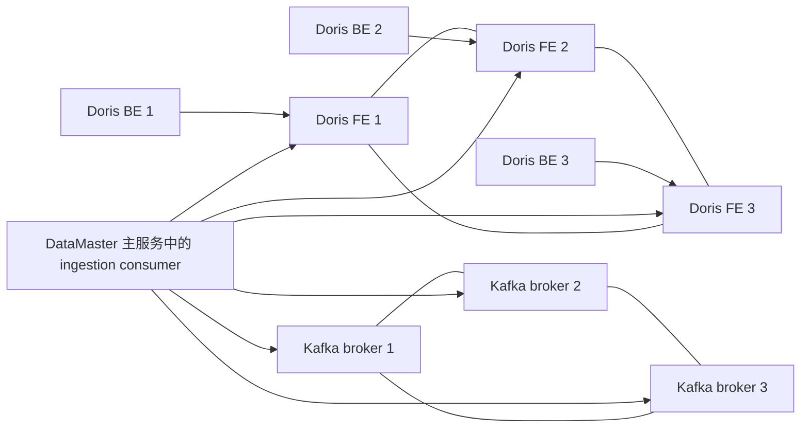

# Ingestion 集群独立部署

这里是 ingestion 基础设施的独立部署目录，不会被主部署脚本 `deploy/start-all.sh` 自动执行，也不会把 Kafka、Doris 加入主系统的默认部署组。

架构如下：



## 配置

编辑 [deploy.yml](deploy.yml)：

- `kafka_nodes`：Kafka 三节点，格式为 `nodeId@可访问IP`；
- `doris_fe_nodes`：Doris FE 三节点；
- `doris_be_nodes`：Doris BE 三节点；
- `kafka_topics`：需要自动创建的 topic，多个 topic 用逗号分隔；
- 镜像名和离线 tar 包名可按现场版本调整。

脚本使用 Docker host network，因此节点 IP 必须是集群节点之间可互通、且 DataMaster 主服务可访问的地址。默认端口为：

| 组件 | 端口 |
|---|---:|
| Kafka broker | 9092 |
| Kafka controller | 9093 |
| Doris FE HTTP | 8030 |
| Doris FE MySQL | 9030 |
| Doris FE edit log | 9010 |
| Doris BE HTTP | 8040 |
| Doris BE heartbeat | 9050 |
| Doris BE BRPC | 8060 |

每个 Kafka、FE、BE 节点至少需要一台 Linux Docker 主机。Doris 节点启动前脚本会设置 `vm.max_map_count=2000000`。

## 一键部署

只部署 ingestion 集群：

```bash
./deploy/ingestion/deploy.sh
```

本地检查，不连接远程主机：

```bash
./deploy/ingestion/deploy.sh --check
```

也可以使用别名：

```bash
./deploy/ingestion/start-all.sh
```

离线部署时，把 Kafka、Doris FE、Doris BE 镜像 tar 放到 `deploy/packages/components/`，文件名与 `deploy/ingestion/deploy.yml` 一致。tar 不存在时脚本会跳过 `docker load`，直接使用目标机器已有镜像。

## 启停和状态

```bash
# 启动全部 ingestion 集群
./deploy/ingestion/start all

# 停止全部 ingestion 集群
./deploy/ingestion/stop all

# 重启全部 ingestion 集群
./deploy/ingestion/restart all

# 查看容器状态
./deploy/ingestion/status all
```

也可以单独操作：

```bash
./deploy/ingestion/start kafka
./deploy/ingestion/start doris
./deploy/ingestion/stop kafka
./deploy/ingestion/status doris-fe
./deploy/ingestion/status doris-be
```

部署后脚本会生成 `deploy/ingestion/.runtime/endpoints.env`，其中包含 Kafka bootstrap 地址和 Doris FE 查询地址。

## 与 DataMaster 主服务的衔接

Kafka、Doris 的容器由本目录管理；DataMaster Java 主服务仍由主部署目录管理。主服务配置中的：

- `datamaster.ingestion.kafka.bootstrap-servers` 应填写 `KAFKA_BOOTSTRAP_SERVERS`；
- `datamaster.ingestion.kafka.topics` 应填写已创建的 topic；
- `datamaster.ingestion.doris-datasource-id` 必须填写 DataMaster 数据源管理中注册的 Doris 数据源 ID；
- `datamaster.ingestion.enabled` 在 Kafka、Doris 和数据源配置完成后再改为 `true`。

脚本不会自动向 DataMaster 业务库写入 Doris 数据源记录，也不会重启主服务。这样可以单独扩缩或维护 ingestion 集群，不影响主系统其他模块。
